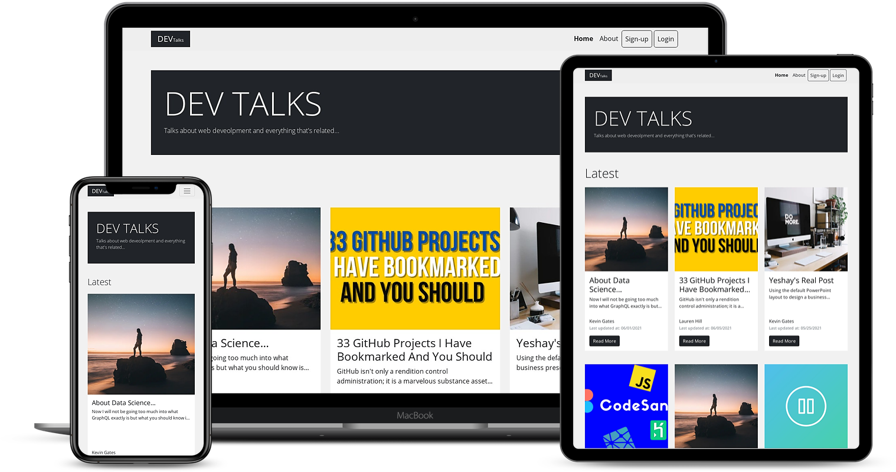

# dev-talks
Blog for developers. Using React,Node with express and MYSQL database. <br />  


Live demo:
 https://dev-talks.netlify.app
 
 
 #### Sample Users To Login
email | password
------------ | -------------
diaz@gmail.com | 123456
hill@gmail.com | 123456


## Installation

#### React Environment Variables
create .env file in the root of the client folder and set following

key | value
------------ | -------------
REACT_APP_PROD_DOMAIN | http://yourlivehost.com
REACT_APP_DEV_DOMAIN | http://localhost:5000 


####  Node Environment Variables
create .env file in the root of the server folder and set following

key | value
------------ | -------------
HOST | your host address
PASSWORD | your db password
DB_NAME | your db name
JWT_SECRET | your jwt string


#### npm scripts<br>
start server :

```diff
cd server
npm run dev
```
start  client:

```diff
cd client
npm start
```


